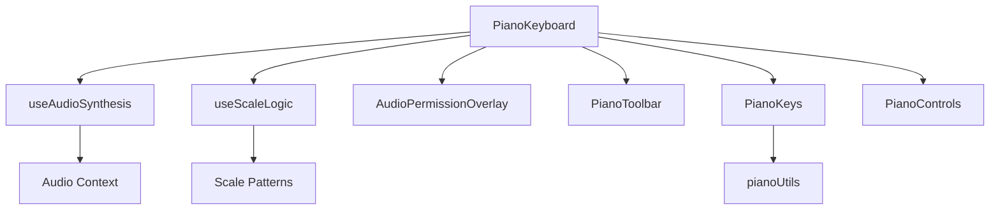

# Piano Keyboard Refactoring Guide

## 🎯 **Refactoring Overview**

Your original `PianoKeyboard.tsx` component was 716 lines and handled multiple responsibilities. I've broken it down into **5 smaller components** and **2 custom hooks** with **1 utility file**.

---

## 📁 **New File Structure**

```
src/
├── components/
│   ├── AudioPermissionOverlay.tsx    (22 lines)
│   ├── PianoToolbar.tsx              (134 lines)
│   ├── PianoKeys.tsx                 (118 lines)
│   ├── PianoControls.tsx             (50 lines)
│   └── PianoKeyboard.tsx             (85 lines) ← Main component
├── hooks/
│   ├── useAudioSynthesis.ts          (98 lines)
│   └── useScaleLogic.ts              (117 lines)
└── utils/
    └── pianoUtils.ts                 (19 lines)
```

**Total lines reduced from 716 to 85 in the main component** ✨

---

## 🧩 **Component Breakdown**

### 1. **AudioPermissionOverlay**

- **Purpose**: Simple modal for audio permission prompt
- **Props**: `onInitializeAudio`
- **Responsibility**: User audio consent UI

### 2. **PianoToolbar**

- **Purpose**: Top controls (note display, scale selector, wave type)
- **Props**: Active keys, scale logic, wave settings
- **Responsibility**: All top-row controls and displays

### 3. **PianoKeys**

- **Purpose**: The actual piano keyboard rendering and interaction
- **Props**: Keys data, active state, scale logic, event handlers
- **Responsibility**: Key rendering, touch/mouse events, visual feedback

### 4. **PianoControls**

- **Purpose**: Bottom controls (octave selection, fullscreen toggle)
- **Props**: Octave state, fullscreen state and handlers
- **Responsibility**: Octave navigation and layout controls

### 5. **PianoKeyboard** (Main)

- **Purpose**: Orchestrates all components and hooks
- **Responsibility**: Layout, state coordination, prop passing

---

## 🎣 **Custom Hooks**

### 1. **useAudioSynthesis**

```typescript
const audioSynthesis = useAudioSynthesis(actx, onAudioPermissionGranted, keys);
```

- **Manages**: Oscillators, gain nodes, active keys, frequencies
- **Returns**: Audio state and control functions
- **Logic**: Note playing, stopping, wave type changes

### 2. **useScaleLogic**

```typescript
const scaleLogic = useScaleLogic();
```

- **Manages**: Scale selection, chord identification, note validation
- **Returns**: Scale state and helper functions
- **Logic**: Scale patterns, chord detection algorithms

---

## 🛠️ **Utility Functions**

### **pianoUtils.ts**

- `createOctave()` - Generates piano keys for one octave
- `createPianoKeys()` - Creates full keyboard (2 octaves)
- `getFrequency()` - Calculates note frequency from MIDI number

---

## ✅ **Benefits of This Refactoring**

### **Maintainability**

- Each component has a single responsibility
- Easy to locate and fix bugs
- Clear separation of concerns

### **Reusability**

- Components can be used independently
- Hooks can be shared across different piano implementations
- Utilities are pure functions

### **Testability**

- Smaller components are easier to unit test
- Custom hooks can be tested in isolation
- Pure utility functions are simple to test

### **Readability**

- Main component is now 85 lines vs 716 lines
- Each file has a clear purpose
- Better organization and structure

### **Performance**

- React can optimize smaller components better
- Hooks prevent unnecessary re-renders
- Memoized calculations in hooks

---

## 🔄 **How to Use the Refactored Code**

The main `PianoKeyboard` component interface **remains exactly the same**:

```typescript
<PianoKeyboard
  actx={actx}
  hasAudioPermission={hasAudioPermission}
  onAudioPermissionGranted={() => setHasAudioPermission(true)}
/>
```

**No changes needed in your parent component!**

---

## 🧪 **Next Steps for Further Improvement**

1. **Add TypeScript strict mode** for better type safety
2. **Add unit tests** for each component and hook
3. **Add error boundaries** for audio context failures
4. **Implement keyboard shortcuts** (separate hook)
5. **Add preset management** (save/load scales and settings)
6. **Performance optimization** with React.memo and useMemo where needed

---

## 🎵 **Component Interaction Flow**



This refactoring makes your code much more maintainable and follows React best practices! 🚀
